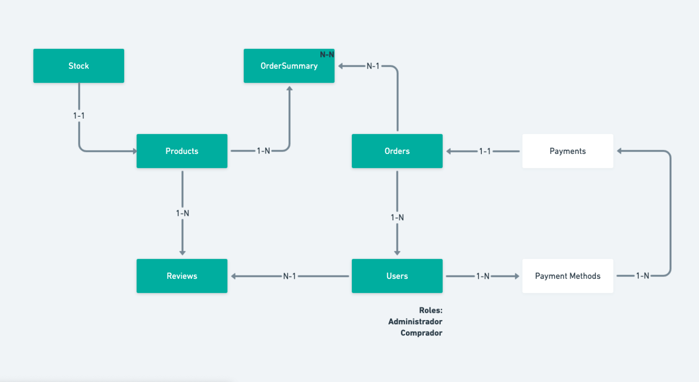

## Backend Node



## Routes

`POST /api/auth/login`

Payload:
```json
{
  "email": "john.doe@company.com",
  "password": "mypassword"
}
```

`POST /api/auth/signup`

Payload:
```json
{
  "name": "John Doe",
  "email": "john.doe@company.com",
  "password": "mypassword"
}
```


`GET /api/users/ (Required authorization token)`